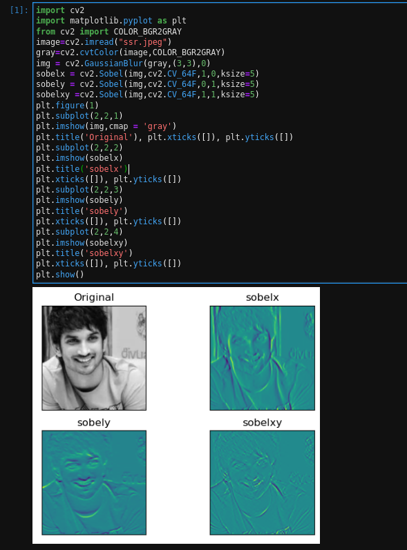
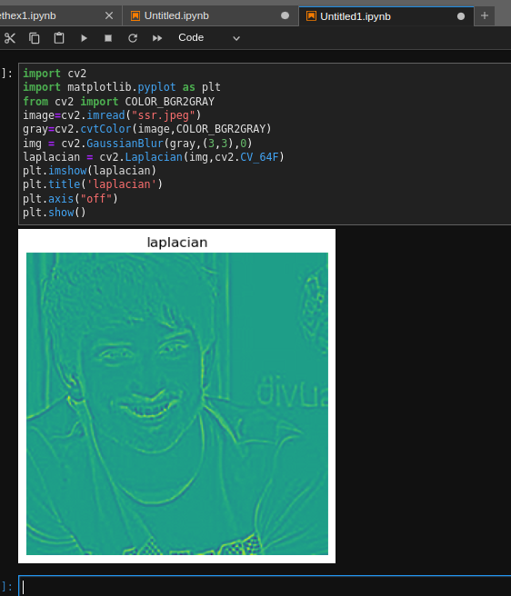
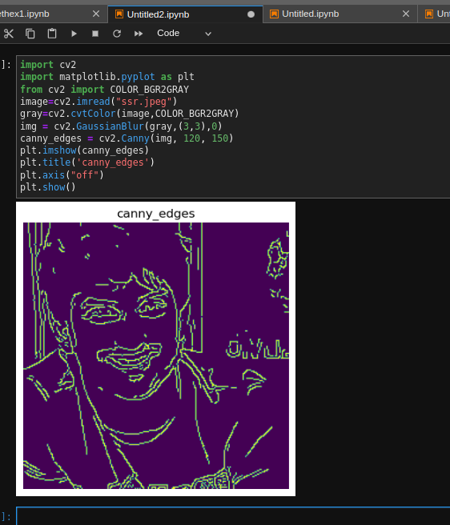

# Edge-Detection
## Aim:
To perform edge detection using Sobel, Laplacian, and Canny edge detectors.

## Software Required:
Anaconda - Python 3.7

## Algorithm:
### Step1:
Import the required packages for further process.

### Step2:
Read the image and convert the bgr image to gray scale image.

### Step3:
Use any filters for smoothing the image to reduse the noise.

### Step4:

Apply the respective filters -Sobel,Laplacian edge dectector and Canny edge dector.

### Step5:
Display the filtered image using plot and imshow.
 
# Program:
``` Python
Developed By: Sai Praneeth K
reference Number: 212222230067
```
## Import the packages
```python

# Load the image, Convert to grayscale and remove noise
```python
import cv2
import matplotlib.pyplot as plt
image = cv2.imread("ssr.jpeg")
gray_image = cv2.cvtColor(image,cv2.COLOR_BGR2GRAY)
new_image = cv2.GaussianBlur(gray_image,(3,3),0)
```
## SOBEL EDGE DETECTOR:
```python
sobelx = cv2.Sobel(img,cv2.CV_64F,1,0,ksize=5)
sobely = cv2.Sobel(img,cv2.CV_64F,0,1,ksize=5)
sobelxy =cv2.Sobel(img,cv2.CV_64F,1,1,ksize=5)
plt.figure(1)
plt.subplot(2,2,1)
plt.imshow(img,cmap = 'gray')
plt.title('Original'), plt.xticks([]), plt.yticks([])
plt.subplot(2,2,2)
plt.imshow(sobelx)
plt.title('sobelx')
plt.xticks([]), plt.yticks([])
plt.subplot(2,2,3)
plt.imshow(sobely)
plt.title('sobely')
plt.xticks([]), plt.yticks([])
plt.subplot(2,2,4)
plt.imshow(sobelxy)
plt.title('sobelxy')
plt.xticks([]), plt.yticks([])
plt.show()
```

## LAPLACIAN EDGE DETECTOR:
```python
import cv2
import matplotlib.pyplot as plt
from cv2 import COLOR_BGR2GRAY
image=cv2.imread("ssr.jpeg")
gray=cv2.cvtColor(image,COLOR_BGR2GRAY)
img = cv2.GaussianBlur(gray,(3,3),0)
laplacian = cv2.Laplacian(img,cv2.CV_64F)
plt.imshow(laplacian)
plt.title('laplacian')
plt.axis("off")
plt.show()
```
## CANNY EDGE DETECTOR:
```python
import cv2
import matplotlib.pyplot as plt
from cv2 import COLOR_BGR2GRAY
image=cv2.imread("ssr.jpeg")
gray=cv2.cvtColor(image,COLOR_BGR2GRAY)
img = cv2.GaussianBlur(gray,(3,3),0)
canny_edges = cv2.Canny(img, 120, 150)
plt.imshow(canny_edges)
plt.title('canny_edges')
plt.axis("off")
plt.show()

```
## Output:
### SOBEL EDGE DETECTOR

### LAPLACIAN EDGE DETECTOR

### CANNY EDGE DETECTOR

## Result:
Thus the edges are detected using Sobel, Laplacian, and Canny edge detectors.
